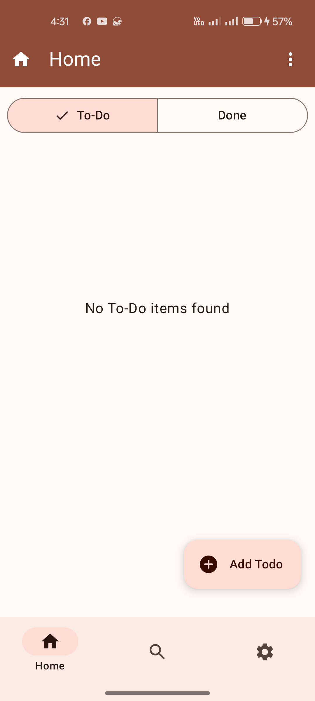
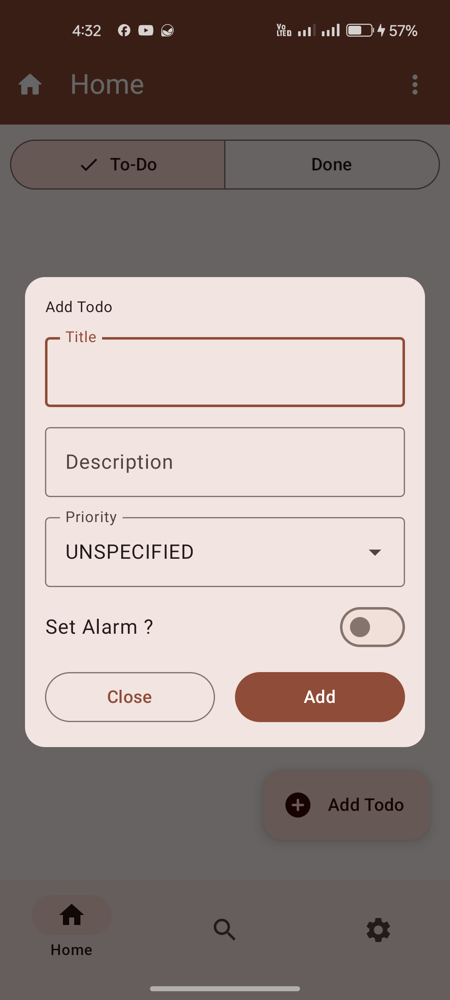
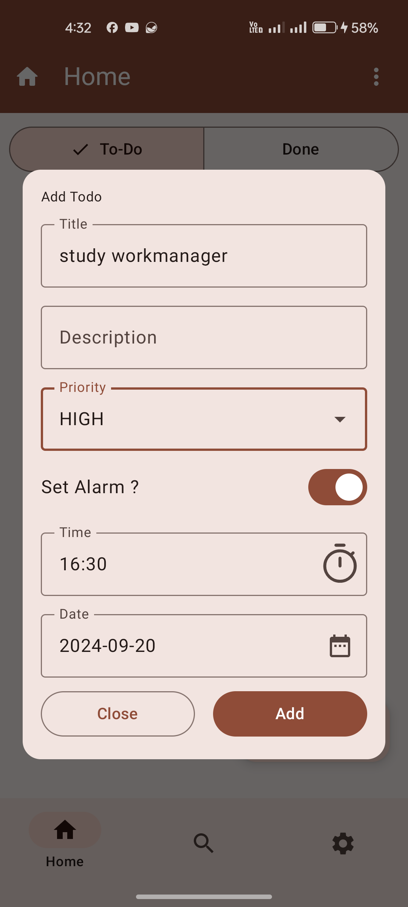
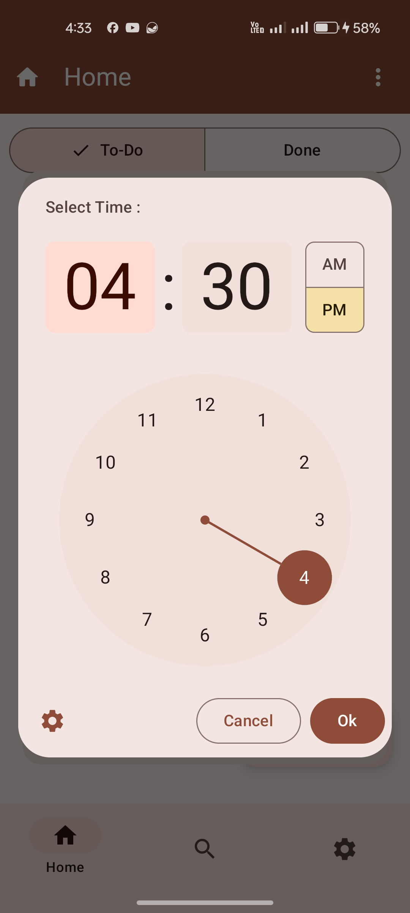
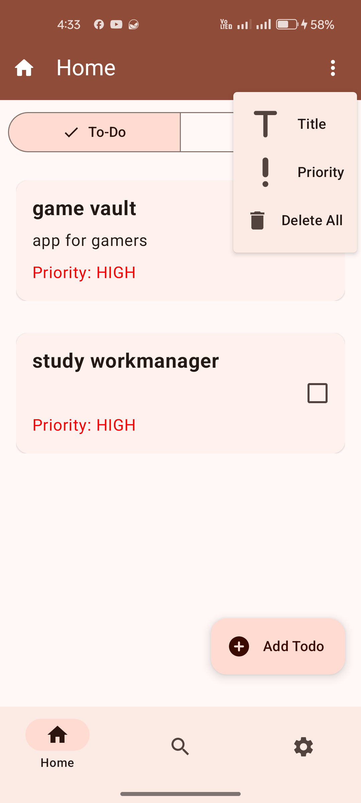
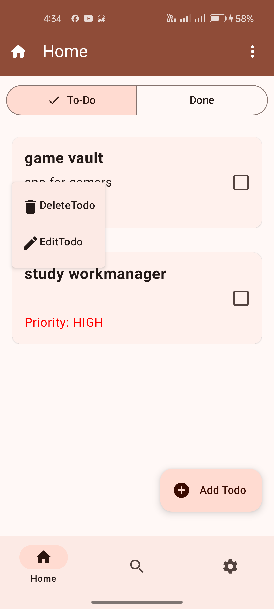
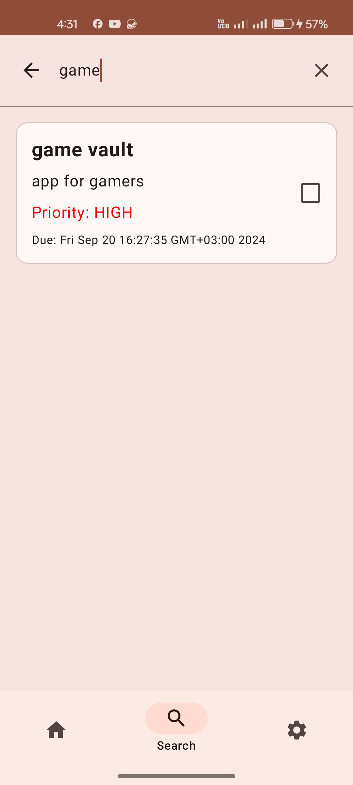
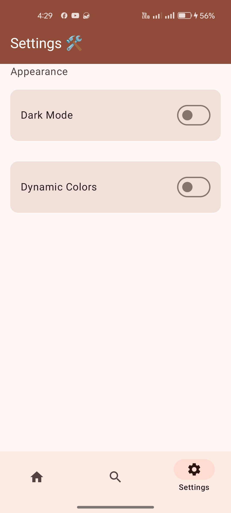
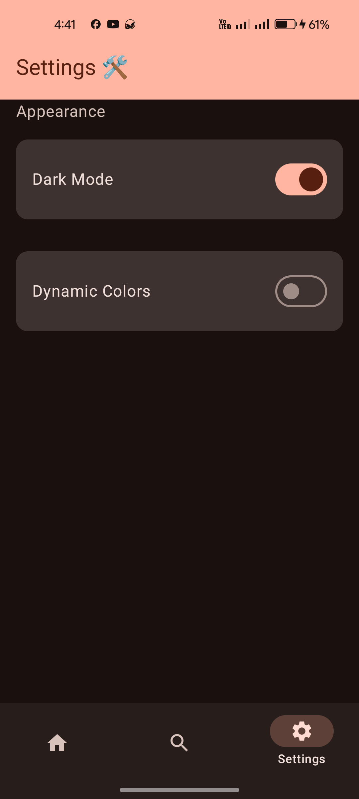

# Todo Tracker - Compose

Todo Tracker is an Android application built with Jetpack Compose that helps users manage their tasks efficiently. The app includes features for adding, updating, deleting, and marking tasks as completed.

## Features

- **Task Management**: Add, update, and delete tasks.
- **Task Filtering**: Filter tasks based on their completion status.
- **Reminders**: Set reminders for tasks to ensure you never forget an important task.
- **Jetpack Compose UI**: A modern UI built using Jetpack Compose for a reactive, declarative, and efficient experience.
- **Bottom Navigation**: Easy navigation between different sections of the app.
- **Persistent Storage**: Save tasks locally using Room database for persistence across sessions.
- **Notifications**: Get notified when it's time to complete a task.
## Video

https://github.com/user-attachments/assets/465afb5b-fceb-4493-b263-7e777603fe7e

## Screenshots
|    |  |  |
|---------------------------------|---------------------------------|-|
|  |  |  |
|  |

|||
|-----|------|
|||

## Technologies Used

- **Kotlin**: The primary language used for app development.
- **Jetpack Compose**: Android's modern toolkit for building native UI.
- **Room**: Database used for local storage of tasks.
- **Hilt**: Dependency Injection framework.
- **Coroutines & Flow**: For asynchronous programming and managing task execution.
- **LiveData**: For observing changes in the data layer and updating the UI accordingly.

## Architecture

This project follows a clean architecture pattern:

- **Domain Layer**: Contains use cases such as `AddTodoUseCase`, `DeleteTodoUseCase`, and others for task management.
- **Data Layer**: Uses Room to persist tasks locally with repositories such as `TodoRepositoryImpl` interacting with the local database.
- **UI Layer**: Implements the UI using Jetpack Compose. Screens are managed by ViewModels such as `HomeViewModel` and `SearchScreenViewModel`.
